# MLB Database Viewer
## Overview
This web application allows users to explore and manage MLB baseball data. Users can look at players, managers, teams, stadiums, and statistics, and gain insights into player and team performance. The application has an easy-to use navigation bar, which lets users easily access the different queries and interfaces.  It also has an intuitive UI with full CRUD functionality.

## Stack
**Backend:** Flask/Python

**Frontend:** HTML, JS

**Front-frontend:** CSS/SCSS, Bootstrap

**DB:** MySQL

## Installation

### Prerequisites
#### Package managers
- pip
- npm
- Python
- MySQL server, via XAMPP/LAMP or otherwise

#### Instructions

1. Clone this repo
2. Instal reqs
```
pip install -r requirements.txt
```
3. Edit `config.json` to use your database credentials
4. Run the web app
```
python .\run.py
```
5. Open http://127.0.0.1:8001/home/ in the browser.
6. Navigate to your desired page.

## Tour
### Main
#### Welcome Page

Main landing page. Nothing fancy!
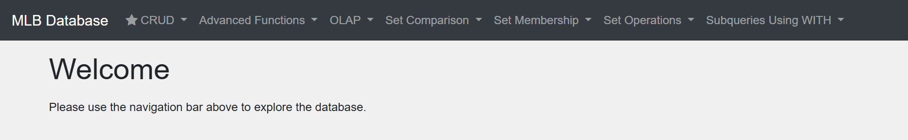

#### Navbar
Using the navigation bar: choose a category and a page. There are two main "sections" of the application: the CRUD interface, and the pre-made queries.
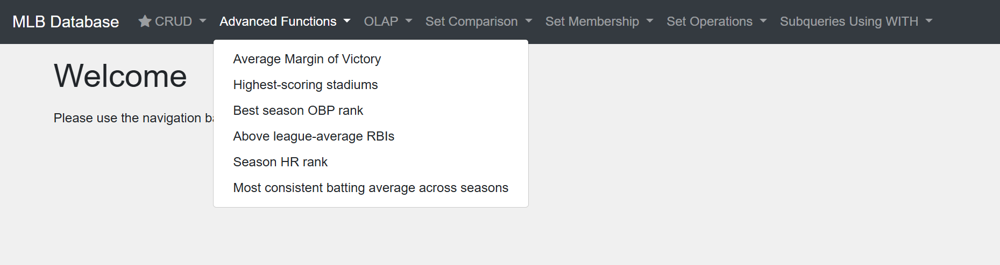


## CRUD Operations
Perhaps the most powerful feature is the CRUD interface. All four CRUD operations can be easily performed on this one single interface! To start, select a table from the navigation bar.

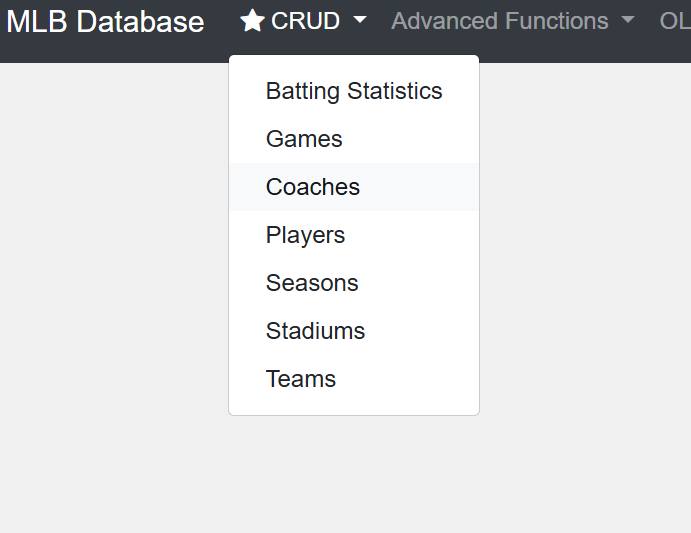

### Read
For the `players` table, the interface makes "Read" easy.
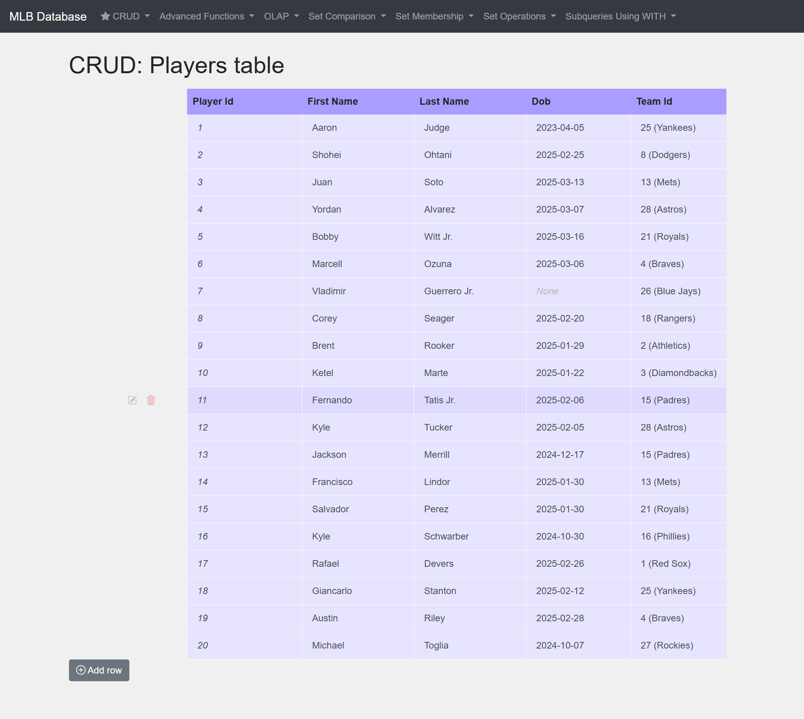

### Create
Click the "Add row" button at the bottom to open the "Create" menu.


Some numbers are less intuitive to use, such as ID numbers of certain entities. Consider the following example: for a user to select a specific team need to know the specific `team_id` of the desired season, i.e. the foreign key.  The user could of course, look at the `teams` table using the CRUD interface, but the interface makes this matter easy. Instead of entering the integer value, the interface provides a handy dropdown menu with a "hint" to make selecting a value in the referenced table much simpler. This is all done dynamically by checking for foreign keys and getting data from the referenced table!

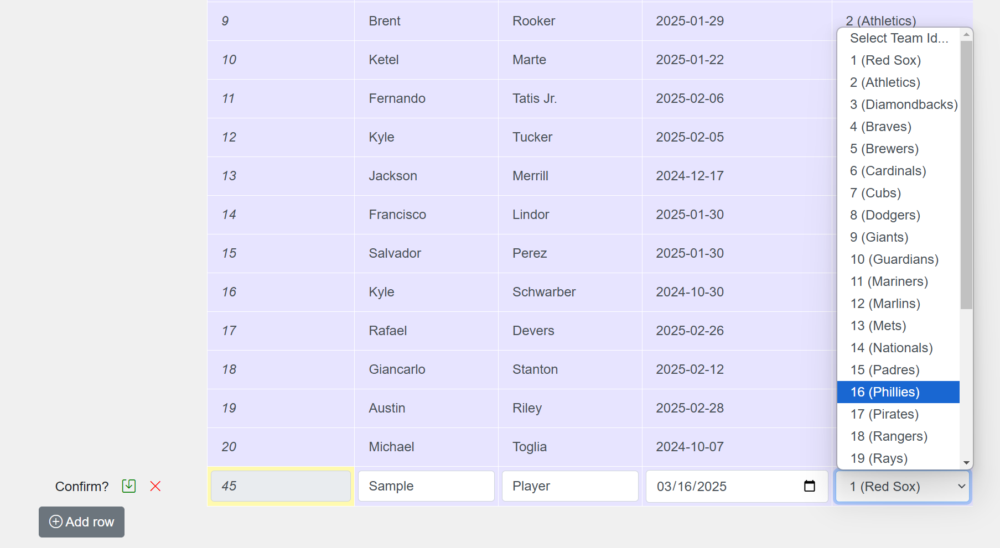


So simply enter the desired information, and press the green button to confirm. The new player is now added!
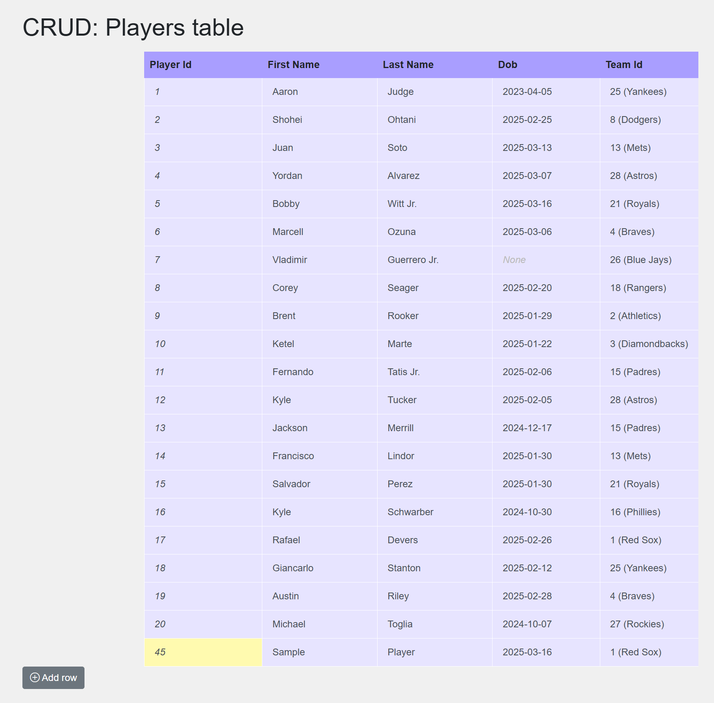

### Update
To update a row, mouse-over the row, and click the pencil icon.

This menu is similar to the "Create" menu, but with the values pre-filled. 

Confirm or cancel on the left, and the player is updated.


### Delete
To delete a row, mouse-over the row, and click the trash icon.

Confirm or cancel on the left, and the player is deleted.


## Query Pages

### Example
##### Advanced Functions > Average Margin of Victory
Here is an example of what a user might see on a query page. Each query has a title, a display of the actual query, a description, and a result.
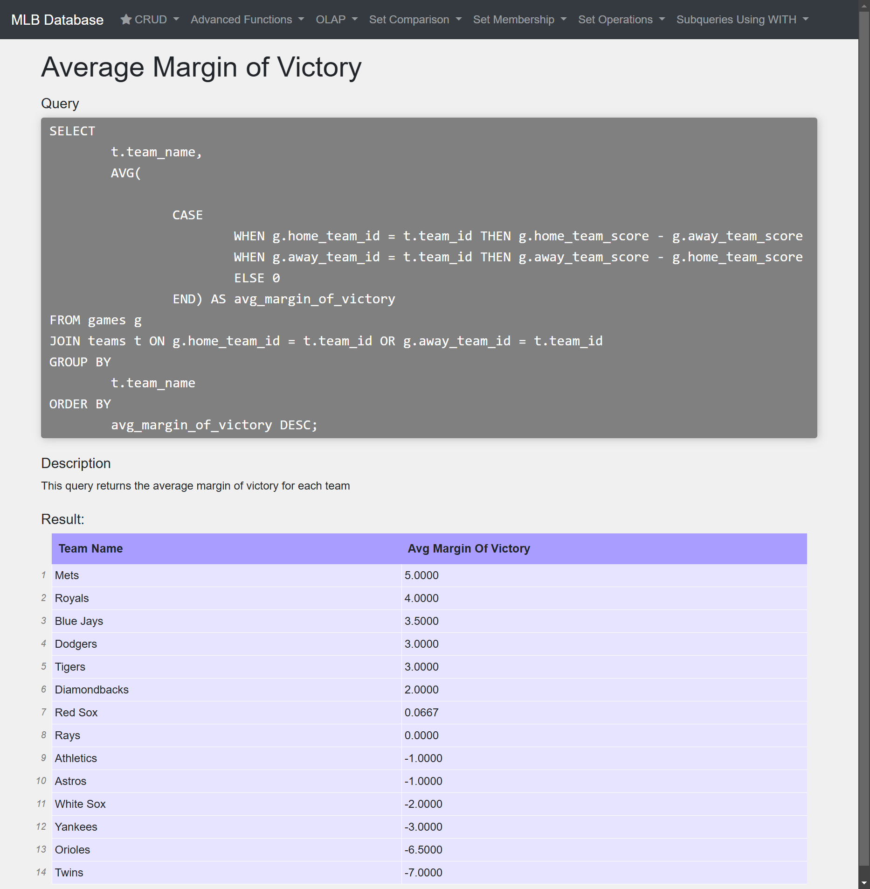


### Static Queries
Some queries are static and are executed the same way each time.
For example, this query finds the intersection between two subqueries

##### Set Operations > Intersect
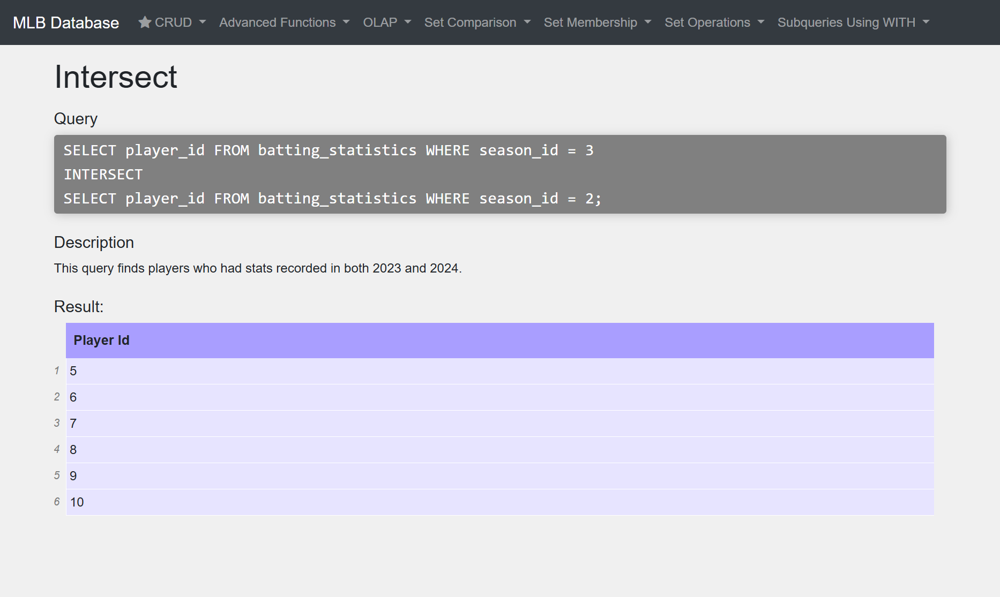

Another finds the players who have not played any games in the database.
##### Set Membership > No Games Played
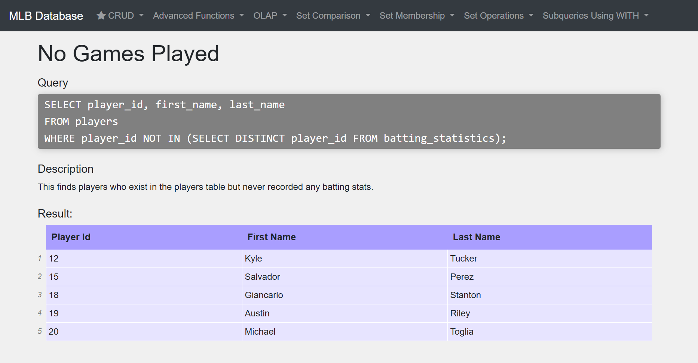

### Dynamic Queries
Other queries can be executed with user input. These queries are properly parameterized and prepared to fend off SQL injection. These queries do not initally have a result:

##### Set Membership > Home Run Threshold
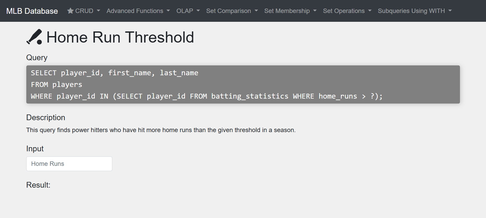

After a value has been entered by the user, the query text is updated, and the result of the query is displayed:
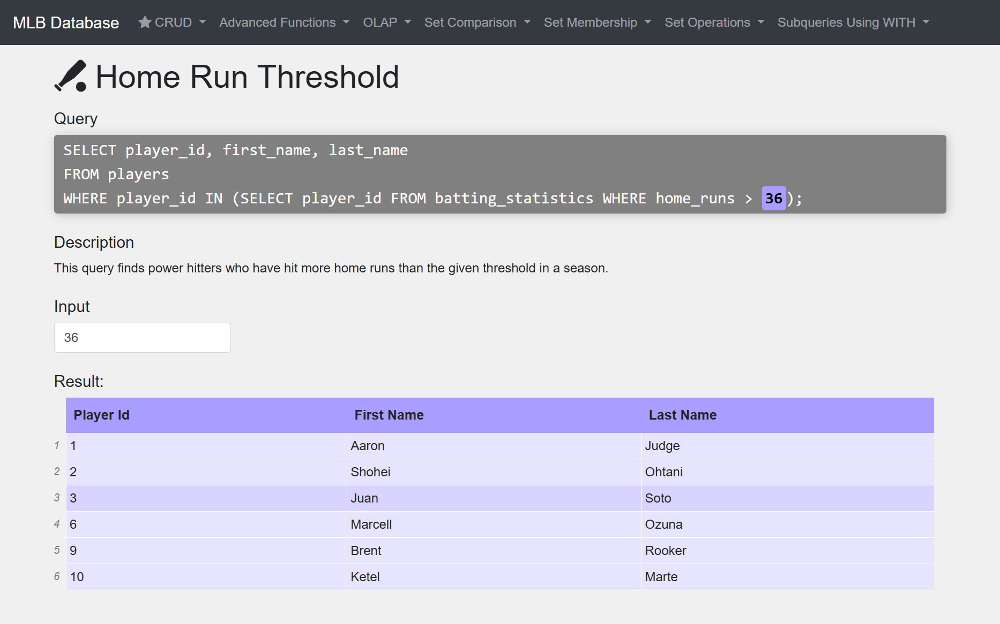

In some cases, users will manually enter the desired number for the query. Other numbers are less intuitive to use, such as database ID numbers of certain entities. Consider the following example: for a user to select a specific season to examine, the user would need to know the specific `season_id` of the desired season, i.e. the foreign key.  

##### Subqueries using WITH > Total HRs per team per season
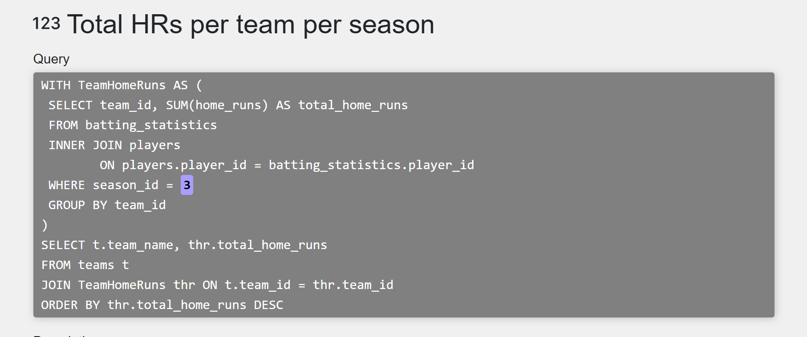


In these cases, this web app fetches data from the referenced table, and in doing so provides a "hint" for the user. Now, instead of manually entering an integer, the user can select the relevant key from a dropdown menu.

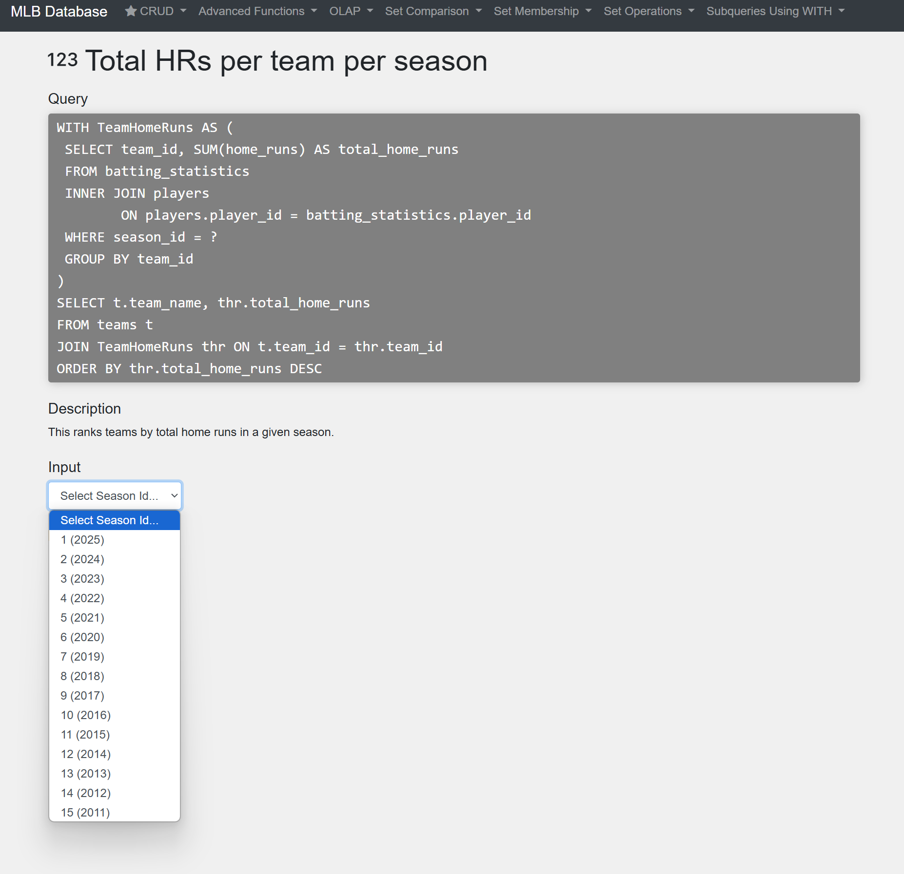


### List of queries
The following queries are available to the user. Full descriptions and text for each query is available in [resources/py/query_maps.py](resources/py/query_maps.py)

#### Advanced Functions
- Average Margin of Victory
- Highest-scoring stadiums
- Best season OBP rank
- Above league-average RBIs
- Season HR rank
- Most consistent batting average across seasons

#### O‌L‌A‌P
- Subtotals and Grand Totals of HRs
- Subtotals and Grand Totals of Stats

#### Set Comparison
- Better Road Teams
- Teams with winning records
- Teams with negative run differentials

#### Set Membership
- Home Run Threshold
- No Games Played

#### Set Operations
- Union
- Intersect
- Except

#### Subqueries Using W‌I‌T‌H
- RBI Leaders
- Total HRs per team per season
- Highest scoring games
